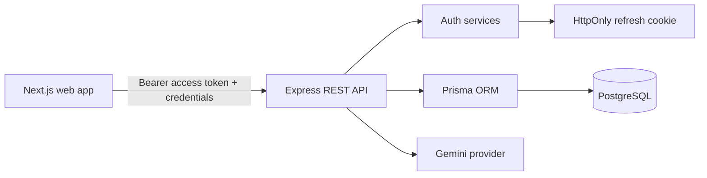

# InterviewKitchen Architecture

## What the Application Does

InterviewKitchen is an AI-assisted interview practice application. An authenticated user can:

1. Create an interview session with a title, category, question format, and difficulty.
2. Choose `TECHNICAL`, `HR`, or `MIXED` interview topics.
3. Choose `MCQ`, `CODING`, `SUBJECTIVE`, or `MIXED` questions.
4. Generate between 1 and 20 questions with Gemini AI.
5. Generate a private question set and start an attempt when ready.
6. Start an attempt and answer questions one at a time.
7. Submit MCQ, subjective, and coding answers.
8. Receive immediate MCQ evaluation and AI evaluation for subjective/coding answers.
9. Complete an attempt and view the score, answers, correctness, and feedback.
10. Return to an interview and review its available attempts.
11. Log out and invalidate the browser session token.

The current web routes are:

| Route | Purpose |
| --- | --- |
| `/` | Product entry page |
| `/register` | Create an account |
| `/login` | Sign in |
| `/dashboard` | Create and list interviews |
| `/interviews/new` | Create an interview with validated settings |
| `/interviews/:interviewId` | Manage questions and start an interview |
| `/interviews/:interviewId/attempts` | Review and continue attempt history |
| `/interviews/:interviewId/attempt/:attemptId` | Complete an attempt |
| `/interviews/:interviewId/attempt/:attemptId/result` | Review score and feedback |
| `/profile` | Update name and change password |

## System Overview

### Frontend

The frontend is a Next.js App Router application in `apps/web`.

- React client pages handle forms and interview interactions.
- Axios provides a shared API client.
- The access token is sent as a Bearer token for protected requests.
- `withCredentials` is enabled so the refresh cookie can be sent to the API.
- The shared app shell provides navigation and logout for authenticated pages.
- Protected pages verify the current session through `/auth/me`; auth pages redirect authenticated users to the dashboard.
- Attempt pages restore submitted answers, provide question navigation, and warn before leaving an unfinished attempt.
- Styling is provided by Tailwind CSS v4 and the global design tokens in `src/app/globals.css`.

### Backend

The backend is a TypeScript Express application in `apps/backend`.

- Routes are mounted below `/api/v1`.
- Zod validates incoming request bodies.
- `protect` verifies access tokens and attaches the authenticated user to the request.
- Ownership checks ensure users can access only their own interviews, attempts, questions, and answers.
- Helmet, CORS, JSON parsing, cookies, structured logging, and centralized errors are configured in `src/app.ts`.

### Database

PostgreSQL stores:

- `User` and `RefreshToken` records.
- `Interview` records owned by users.
- `InterviewQuestion` records belonging to interviews.
- `InterviewAttempt` records belonging to users and interviews.
- `InterviewAnswer` records belonging to attempts and questions.

Prisma defines the schema and migrations in `apps/backend/prisma`. Deleting an interview cascades to its questions, attempts, and answers. An attempt/question pair is unique, preventing duplicate answers for the same question.

### AI Integration

Gemini is used for two backend capabilities:

- Generating questions from interview type, question type, and difficulty.
- Evaluating coding and subjective answers with a score from 0 to 10 and written feedback.

AI output is parsed and validated with Zod before it is stored. MCQ answers are evaluated against the stored correct answer. The Gemini API key remains server-side and must never be placed in frontend environment variables.

## API Surface

All paths below are relative to `/api/v1` and protected routes require `Authorization: Bearer <access-token>`.

### Authentication

| Method | Path | Description |
| --- | --- | --- |
| `POST` | `/auth/register` | Register with name, email, and password |
| `POST` | `/auth/login` | Login and receive an access token plus refresh cookie |
| `POST` | `/auth/logout` | Revoke the refresh token and clear its cookie |
| `GET` | `/auth/me` | Read the authenticated user payload |

Registration requires a password of 8 to 100 characters containing uppercase, lowercase, numeric, and special characters.

### Interviews and Dashboard

| Method | Path | Description |
| --- | --- | --- |
| `POST` | `/interviews` | Create an interview |
| `GET` | `/interviews` | List the current user's interviews |
| `GET` | `/interviews/:id` | Read one owned interview |
| `PATCH` | `/interviews/:id/status` | Advance interview status |
| `GET` | `/interviews/dashboard/stats` | Read dashboard statistics |
| `GET` | `/interviews/dashboard/recent-attempts` | Read recent attempts |

Interview statuses move from `CREATED` to `IN_PROGRESS` to `COMPLETED`. Questions can be changed or generated only while an interview is `CREATED`.

### Questions

| Method | Path | Description |
| --- | --- | --- |
| `POST` | `/interviews/:interviewId/questions` | Create a question |
| `GET` | `/interviews/:interviewId/questions` | List questions without exposing correct answers |
| `GET` | `/interviews/:interviewId/questions/:id` | Read question details |
| `PATCH` | `/interviews/:interviewId/questions/:id` | Update a question |
| `DELETE` | `/interviews/:interviewId/questions/:id` | Delete a question |
| `POST` | `/interviews/:interviewId/questions/generate` | Generate 1 to 20 AI questions |

### Attempts and Answers

| Method | Path | Description |
| --- | --- | --- |
| `POST` | `/interviews/:interviewId/attempts` | Start an attempt |
| `GET` | `/interviews/:interviewId/attempts` | List attempts |
| `GET` | `/interviews/:interviewId/attempts/:attemptId` | Read one attempt |
| `PATCH` | `/interviews/:interviewId/attempts/:attemptId/complete` | Complete an attempt and calculate its score |
| `GET` | `/interviews/:interviewId/attempts/:attemptId/result` | Read the evaluated result |
| `POST` | `/interviews/:interviewId/attempts/:attemptId/answers` | Submit an answer |
| `GET` | `/interviews/:interviewId/attempts/:attemptId/answers` | List submitted answers |
| `PATCH` | `/interviews/:interviewId/attempts/:attemptId/answers/:answerId` | Evaluate a coding or subjective answer |

Only one active attempt is allowed for a user and interview. Completion requires an answer for every question.

## Security Model

- Passwords are hashed with bcrypt.
- Access tokens expire after 15 minutes.
- Refresh tokens are stored in an HttpOnly cookie and persisted as hashes.
- JWT secrets must be at least 32 characters.
- CORS allows the configured local frontend origin with credentials.
- Helmet adds common HTTP security headers.
- Zod validates authentication, interview, question, generation, and answer inputs.
- Protected resources enforce ownership through the authenticated user ID.
- Invalid or expired JWTs return `401 Unauthorized`, not `500 Internal Server Error`.
- The frontend removes an expired access token and returns the user to login.

## Current Limitations

- There is currently no refresh endpoint, so an expired 15-minute access token requires login again.
- The frontend stores the access token in `localStorage`; an HttpOnly access-token flow would reduce XSS exposure for production.
- The frontend API base URL is currently `http://localhost:5000/api/v1` and is not yet environment-configurable.
- Backend CORS is currently hard-coded for `http://localhost:3000`.
- There is no pagination or filtering on list endpoints.
- Previously submitted answers cannot currently be edited from the frontend because the backend answer `PATCH` endpoint evaluates an answer and ignores its request body.
- Timed attempts and automatic submission are not currently implemented.
- A dedicated forgot-password/reset-password flow is not implemented by the backend.
- Automated test coverage is not yet configured in the application packages.
